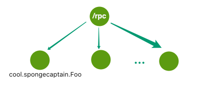

# README

> README 文档会逐步补充完善。
>
> 本项目使用了若干个来自于 [Dubbo]() 的术语，项目结构上也相当程度上参考了 Dubbo。

这个项目是一个简单的 RPC 框架，将依赖于：

- ZooKeeper（包括 ZooKeeper 客户端 Curator）；

模块分为如下：

- rpc-common：一些公共类，例如异常；
- rpc-core：RPC 的核心功能，例如服务注册；

## 1. 注册中心

Dubbo 中使用 ZooKeeper 服务中心如下图所示：

我将上述注册中心模型进行简化（我们没有必要如此复杂），如下图所示：

在根节点 `/rpc` 下的每一个节点都是服务节点：

- 节点的 path：一个接口的完全限定名，例如图中的 cool.spongecaptain.Foo 接口；
- 节点的 data：能够提供此接口的服务的服务器地址，例如 localhost:2222；

注册中心能够提供的功能有：

- Provider 能够向注册、更新、删除中心注册其能够提供的服务；
- Consumer 能够从注册中心获取其所需的服务，并在服务被增删改时得到提醒；

注册中心的作用事实上在 Dubbo 的 Dubbo Architecture 说地很明白了，如下图所示：

---

项目的注意事项，[Dubbo-samples](https://github.com/Spongecaptain/dubbo-samples) 中的不少模块有提供内嵌的 ZooKeeper 以供调试使用，但是本项目要求你必须在本地启动一个 ZooKeeper（Standalone 模式即可）。且项目默认 ZooKeeper 服务端监听着 2181 端口。

使用 Docker 来启动一个 ZooKeeper 是一个很好的选择。

## 2. 

